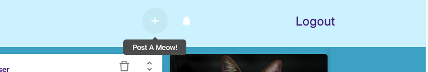
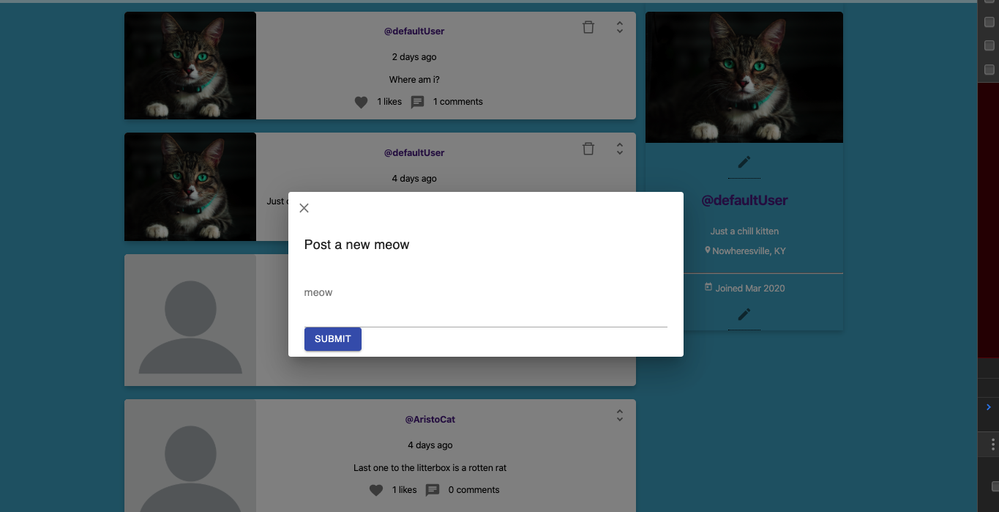
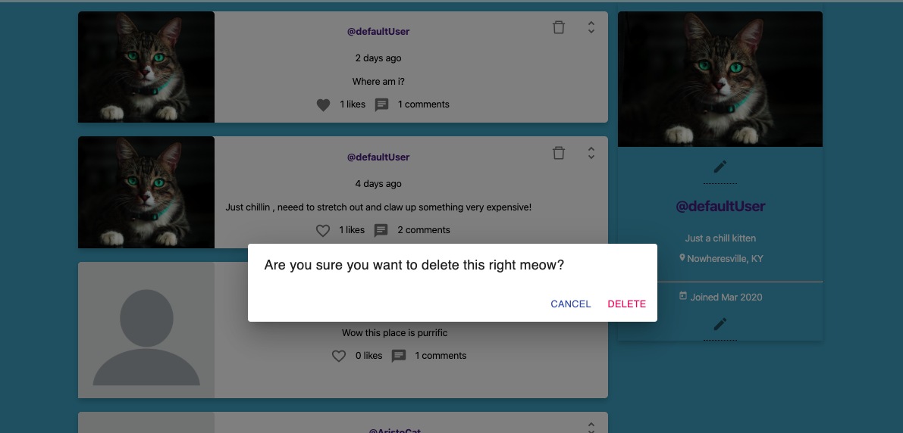
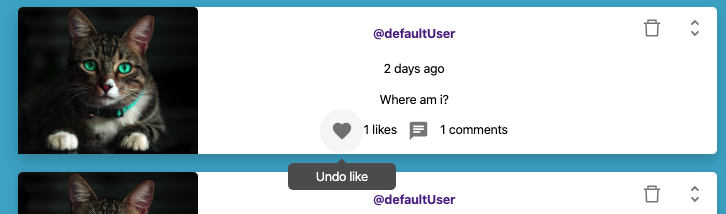
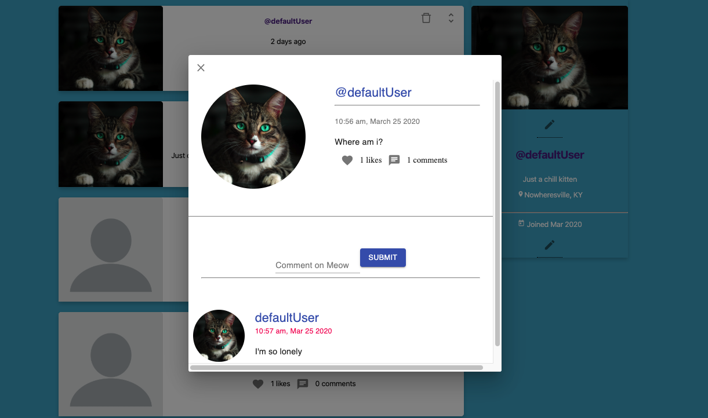
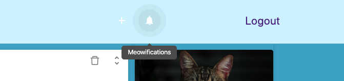
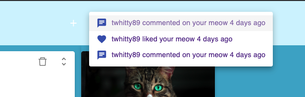
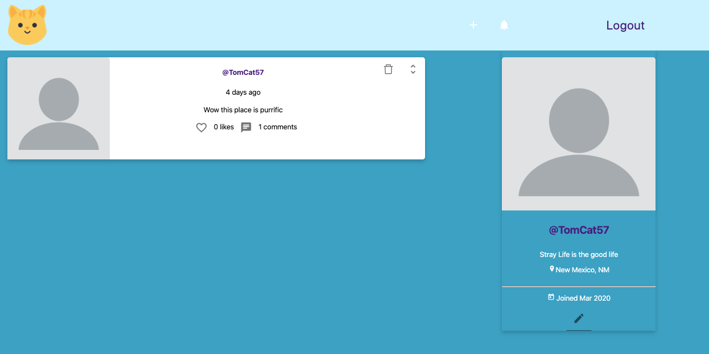

# CattyShack - A social app for cats!

A social media app based on the personalities of our favorite felines. Actually this was an idea I got from a friend and decided to bring it to life just for fun. I also thought it would be a great little app to share with my 3 children and make them laugh.

## Tech Stack

* React
* Node/Express
* Postgres

## Startup

* Clone the project to an empty folder and initialize
* `npm t`  (basic smokescreen tests for component rendering)
* `npm start` (starts the application on port 3000)

## Production build

To create a production build use the `npm run build` command

## Registration

If you want to skip the registration process see the logging in section for default credentials.

As a first time user you can create a Catty Shack account by inputting your username and password.

e.g.

* username - theBugs52
* password - looneytoons53$$  (must be at least 8 characters with 1 uppercase, lowercase, number & special character)

## Logging In

Once you've registered you will be automatically redirected to the login page where you can enter your recently created credentials

### Default Credentials

* `defaultUser` 
* `AAaa$$11`

## Accessing The Default User

The default user is a pre-designed user profile for a random cat. You can post moews (posts), comment on meows, and like or unlike meows. It's a lot of fun! As the authenticated user of a profile you can also update your bio, check notifications from other users, and reciprocate likes and comments to your fellow felines!

## Edit your profile picture!
 
 
Just hover over and click the edit icon right below your use profile picture. This triggers a drop-down menu or file explorere window to appear. From there you can change up your pic to something you prefer. ** Word Of Caution ** As of now images are being stored in Heroku's ephemeral image storage. This mean they could be removed anytime so do not expect them to stay. Later on down the road, all images will be store on AWS. More to come on this!

## Editing Profile Information (Bio, Website, Location)

Hovering over the edit icon on the main profile card will bring up a tooltip that says `edit user details`. Simply click that button and change your details on the spot. Thanks to React state you see everything update in real time!

## Posting Meows
Click the + icon in the navbar and scratch out a new meow! The rest of the Catty Shack community can now comment and like. Just remember, once you post it's fair game!

## Deleting Meows

Clicking the delete button (trash icon) in the top right corner of the meow card will open a dialog to ensure you really want to delete your meow. 

## Like/Unlike Meows

I'm sure most of us have used social media at one point or another, but just for certainty's sake.. Push the heart icon to like and unlike a meow. This will send a notification to the user of the meow that he has a new like! If you remove the like it will also remove his/her notification and they will be none the wiser. Shhhh I won't tell. 

## Post A Comment

It's really fun to post comments on meows. Users can read them and respond with their own likes and comments! To use this feature click the open dialog icon in the top right corner of the meow card. Say what you will and click submit!

## Check Your Notifications

If a feline friend happens to like your meows, he or she can like or comment on those posts. You as the owner of the meow will get notified when this happens. The bell icon in the navbar will turn red with the number of notifications you have received. 

When you click the bell your notifications will be listed in red text. If a notification happens to be a comment you can click the notification and it will open the meow where the comment was posted. If you got a like, that will be shown as well! Once all your "meowifications" have been read, the text will turn blue!

## Visit A User's Page

If you are curious who is commenting on your meows then visit another user's main page. Click the user's handle and access their personal meows and information such as bio, location, and website. 

### Wanna go home? 
If you need to get back to the homepage just click the yellow kitten icon in the top left corner of the app!

