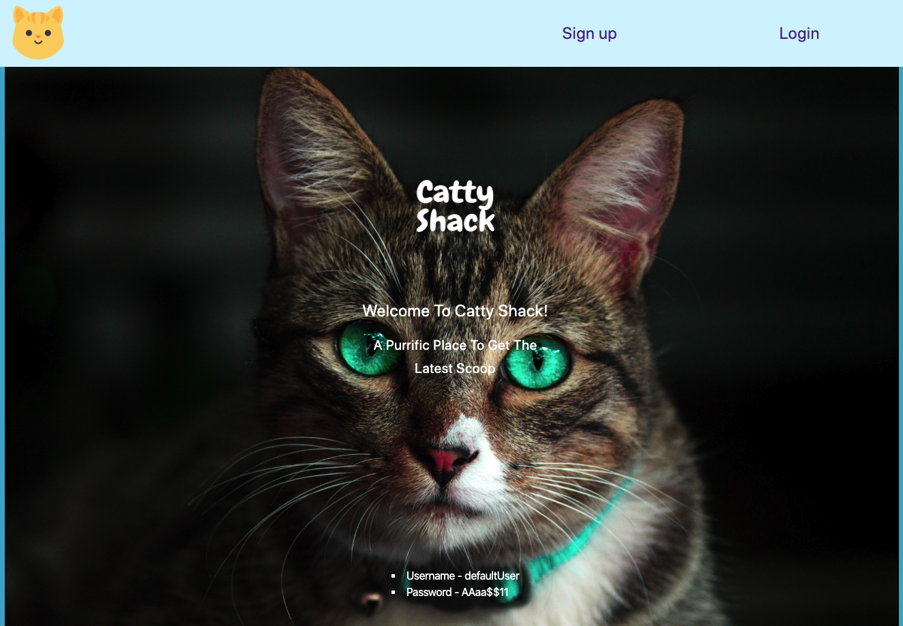
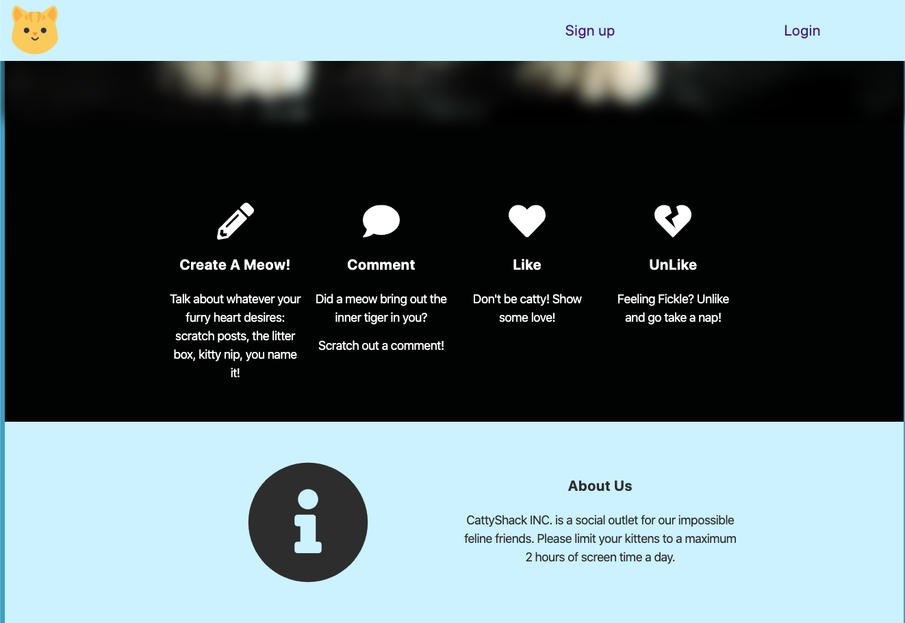
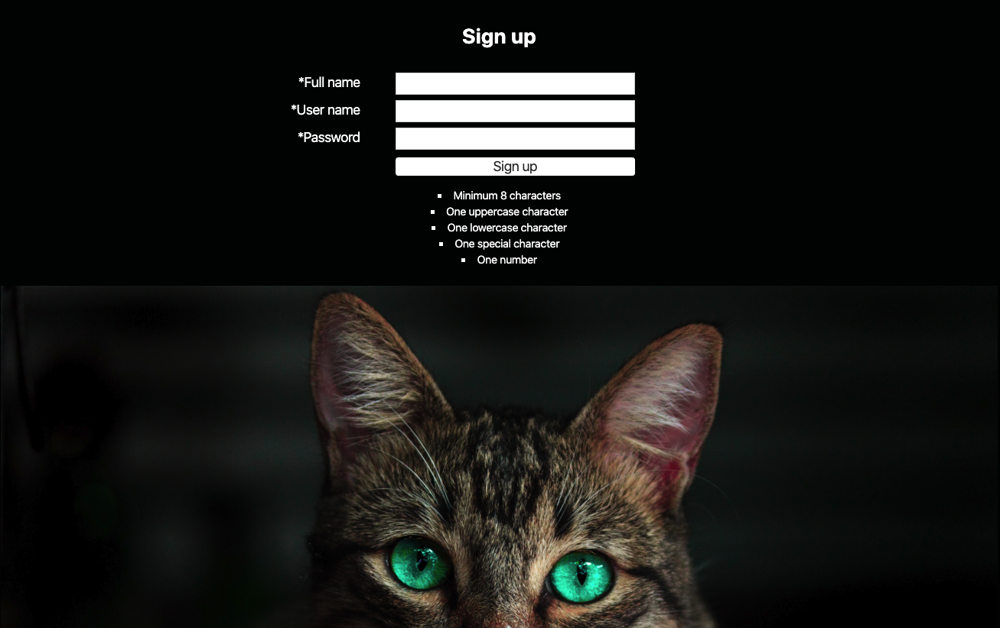
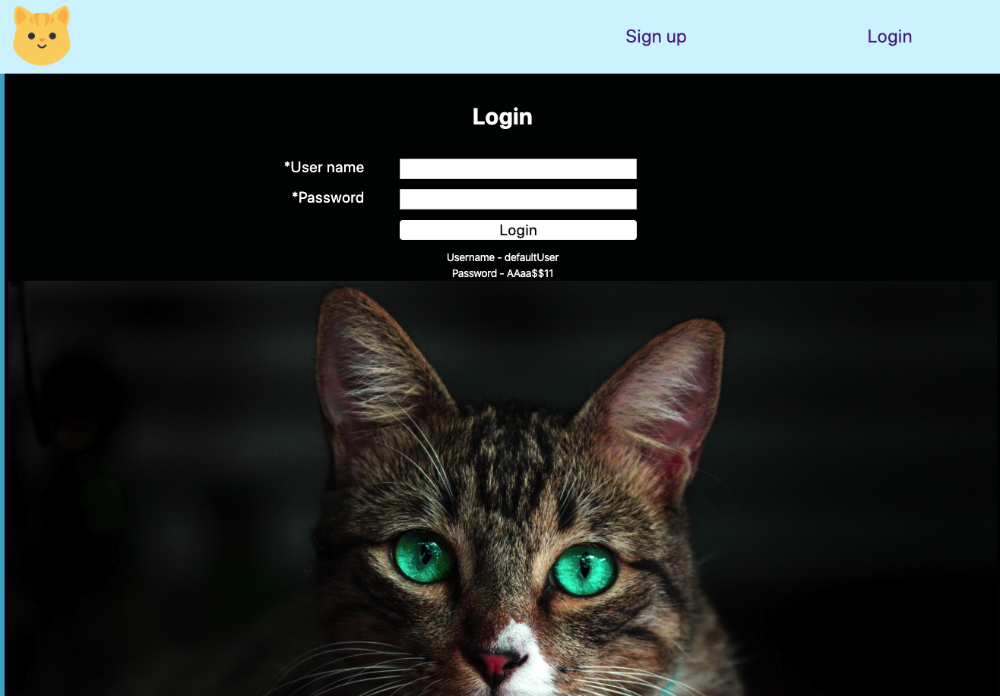
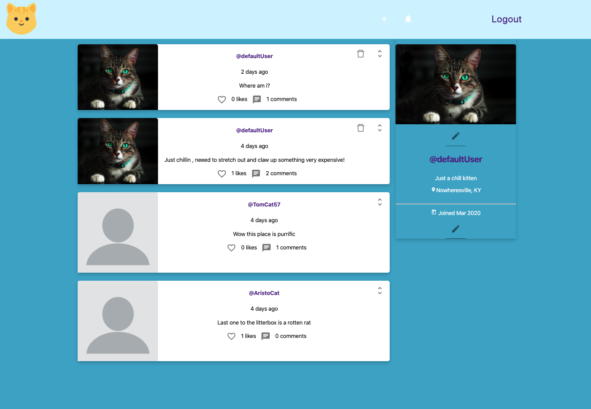
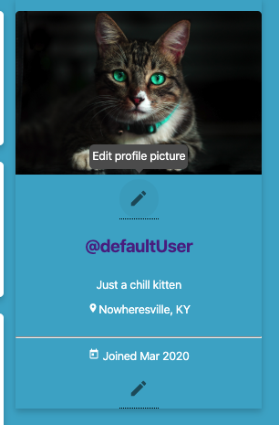
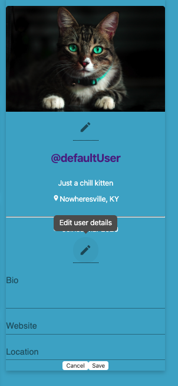

# CattyShack - A social app for cats!

A social media app based on the personalities of our favorite felines. Actually this was an idea I got from a friend and decided to bring it to life just for fun. I also thought it would be a great little app to share with my 3 children and make them laugh.

## Tech Stack

* React
* Node/Express
* Postgres

## Startup

* Clone the project to an empty folder and initialize
* `npm t`  (basic smokescreen tests for component rendering)
* `npm start` (starts the application on port 3000)

## Production build

To create a production build use the `npm run build` command

## Registration

If you want to skip the registration process see the logging in section for default credentials.

As a first time user you can create a Catty Shack account by inputting your username and password.

e.g.

* username - theBugs52
* password - looneytoons53$$  (must be at least 8 characters with 1 uppercase, lowercase, number & special character)

## Logging In

Once you've registered you will be automatically redirected to the login page where you can enter your recently created credentials

### Default Credentials

* `defaultUser` 
* `AAaa$$11`

## Accessing The Default User

The default user is a pre-designed user profile for a random cat. You can post moews (posts), comment on meows, and like or unlike meows. It's a lot of fun! As the authenticated user of a profile you can also update your bio, check notifications from other users, and reciprocate likes and comments to your fellow felines!

## Edit your profile picture!

Just hover over and click the edit icon right below your use profile picture. This triggers a drop-down menu or file explorere window to appear. From there you can change up your pic to something you prefer. ** Word Of Caution ** As of now images are being stored in Heroku's ephemeral image storage. This mean they could be removed anytime so do not expect them to stay. Later on down the road, all images will be store on AWS. More to come on this!

## Editing Profile Information (Bio, Website, Location)

Hovering over the edit icon on the main profile card will bring up a tooltip that says edit
## Deleting Entries

Clicking the delete button from both the entry content page and the main entries list page will remove an entry from the database.. be careful where you click!!

## Viewing entries by journal

You can browse which entries belong to which journal by clicking on the journal icons in the sidebar on the left. You can also add new entries from this view as well. Once you add an entry from this view, you will be redirected to the previous screen. 

## Adding Journals

You can also add journals by simply clicking the new journal button on the sidebar in the homepage.  This will direct you to the add journal page where you enter a title for your journal and click submit. Easy as that!

